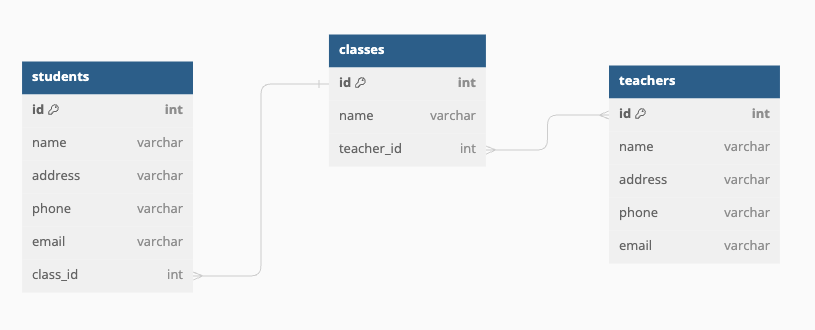

# Lesson

## Brief

### Preparation

Basic understanding of RDBMS tables and columns.

### Lesson Overview

This lesson introduces database concepts, data modeling and normalization. Learners will be able to perform data modeling and create ERD from case study. Learners will also be able to normalize database schema.

---

## Part 1 - Introduction to relational databases

Conceptual knowledge, refer to slides.

---

## Part 2 - Data modeling

### 2.1 SQL Data Types

Here are the common data types, every database has its own set of data types.

| Data Type  | Description                |
| ---------- | -------------------------- |
| `INT`      | Integer, whole number.     |
| `VARCHAR`  | Variable length character. |
| `TEXT`     | Long text.                 |
| `DATE`     | Date.                      |
| `TIME`     | Time.                      |
| `DATETIME` | Date and time.             |
| `BOOLEAN`  | True or false.             |

### 2.2 Entity-relationship diagram (ERD)

An entity-relationship diagram (ERD) is a visual representation of entities and their relationships in a database. ERD is a data modeling technique. It is a graphical representation of data requirements for a database.



#### 2.2.1 Entities

An entity is a real-world object, for example, an employee, bank account, car, etc. An entity has attributes that represent properties such as an employee has a name, age, and salary. An entity set is a collection of similar entities. For example, all employees have some common attributes.

#### 2.2.2 Relationships

A relationship is an association among entities. For example, an employee works at a department, a car has a model, etc. A relationship set is a collection of similar relationships. For example, all employees work at some department. A relationship can have attributes. For example, the salary of an employee in a department.

#### 2.2.3 Cardinality

Cardinality represents the number of entities in one entity set, which can be associated with the number of entities of another entity set. There are three types of cardinality:

- One to one: One entity from entity set A can be associated with at most one entity of entity set B and vice versa.
- One to many: One entity from entity set A can be associated with more than one entity of entity set B, but an entity from entity set B can be associated with at most one entity of entity set A.
- Many to many: One entity from entity set A can be associated with more than one entity of entity set B and vice versa.

### 2.3 ERD Tools

Use [dbdiagram.io](https://dbdiagram.io/d) to design and create ERD. Sign in with your Google or Github account.

`dbdiagram.io` is a free online database schema design and modeling tool. It allows you to draw ERD using a markup language called DBML (Database Markup Language). It is a simple and easy-to-use language to define and document database schemas.

### 2.4 Case Study

#### 2.4.1 Scenario 1

Construct an ERD for a car insurance company whose customers own one or more cars each. Each car has associated with it zero to any number of recorded accidents.

Each entity has the following attributes:

- Customer: id, name, address, phone, email
- Car: id, make, model, year, car_plate
- Accident: id, date, location, description, car_id

Use the following DBML to create the ERD.

```dbml
Table customers {
  id int [pk, increment]
  name varchar
  address varchar
  phone varchar
  email varchar
}

Table cars {
  id int [pk, increment]
  make varchar
  model varchar
  year int
  car_plate varchar
  customer_id int
}

Table accidents {
  id int [pk, increment]
  date datetime
  location varchar
  description text
  car_id int
}

Ref: cars.customer_id > customers.id // many-to-one

Ref: accidents.car_id > cars.id // many-to-one
```

#### 2.4.2 Scenario 2

Construct an ERD for a school system whose classes have students and teachers. Each student belongs to a single class. Each teacher may teach more than one class, and each class may have more than one teacher.

Each entity has the following attributes:

- Student: id, name, address, phone, email, class_id
- Teacher: id, name, address, phone, email
- Class: id, name, teacher_id

> Write the DBML to create the ERD.

#### 2.4.3 Scenario 3

Construct an ERD for a company that sells movies online. The company has a website where customers can browse available movies and place orders. Each order can contain multiple movies.

> List the entities and attributes. Write the DBML to create the ERD.

---

## Part 3 - Normalization

Normalization is a process of organizing the data in the database in accordance with a series of so-called _normal forms_ to remove _data redundancy_, avoid _anomalies_ and ensure _referential integrity_.

The objective of normalization is as follows:

1. To free the database from unwanted insertions, updates, & deletion dependencies
2. To reduce the need for refactoring the database as new types of data are introduced
3. To make the relational model more informative to users
4. To make the database neutral to the query statistics

### 3.1 Data Redundancy

Data redundancy is a condition created within a database or data storage technology in which the same piece of data is held in two separate places. This can mean two different fields within a single database, or two different spots in multiple software environments or platforms.

### 3.2 Anomalies

There are three types of anomalies that occur when the database is not normalized.

- Insertion anomaly: Inability to insert data into the database due to absence of other data.
- Deletion anomaly: Loss of data due to deletion of other data.
- Update anomaly: Update inconsistency due to redundancy of data.

### 3.3 Referential Integrity

Referential integrity is a database concept that ensures that relationships between tables _remain consistent_. Every value of a foreign key _must be matched_ to a value of the primary key of another table.

- If the primary key value does not exist, the row referencing the value in the other table cannot be inserted into the table.
- If a value of the primary key is modified or deleted, all matching foreign key values must be modified/deleted as well.
- It prohibits the deletion of a row in the referenced table if there are corresponding rows in the referencing table.

### 3.4 Normal Forms

There are six normal forms (1NF, 2NF, 3NF, BCNF, 4NF, 5NF) for database normalization.

- First Normal Form (1NF)
- Second Normal Form (2NF)
- Third Normal Form (3NF)
- Boyce-Codd Normal Form (BCNF)
- Fourth Normal Form (4NF)
- Fifth Normal Form (5NF)

Here we are just going to discuss the first 3 normal forms, which are the most commonly used.

#### 1NF

A table is in 1NF if:

- Each table cell should contain a single value
- Each record needs to be unique
- Each column should contain values of the same type

#### 2NF

A table is in 2NF if:

- Must be in 1NF
- No partial depencies (All non-key attributes must fully depend on the primary key )

#### 3NF

A table is in 3NF if:

- Must be in 2NF
- No transitive dependencies (Non-key attributes shouldn't depend on other non-key attributes)

### Denormalized Table

No normalization. Nested and redundant data is allowed.

### 3.5 Case Study

Let's use an example of ecommerce company with customer orders. Each customer can place multiple orders. Each order can contain multiple items.

#### 3.5.1 First Normal Form (1NF)

The `OrderDetails` table is in 1NF because each row is unique and each column has a single value.

| OrderID | ItemID | ItemName | ItemPrice | CustomerID | CustomerName | OrderDate  |
| ------- | ------ | -------- | --------- | ---------- | ------------ | ---------- |
| 100     | 10     | iPhone   | 1000      | 1          | John         | 2021-01-01 |
| 100     | 20     | iPad     | 500       | 1          | John         | 2021-01-01 |
| 200     | 30     | Macbook  | 2000      | 1          | John         | 2021-01-02 |
| 300     | 10     | iPhone   | 1000      | 2          | Mary         | 2021-01-03 |
| 300     | 30     | Macbook  | 2000      | 2          | Mary         | 2021-01-03 |

The problem is that now we don’t have a unique primary key. That is, 100 occurs in
the `OrderID` column in two different rows.

To create a unique primary (composite) key, let's number the lines in each order by adding a new column called `LineNumber`.

| OrderID | LineNumber | ItemID | ItemName | ItemPrice | CustomerID | CustomerName | OrderDate  |
| ------- | ---------- | ------ | -------- | --------- | ---------- | ------------ | ---------- |
| 100     | 1          | 10     | iPhone   | 1000      | 1          | John         | 2021-01-01 |
| 100     | 2          | 20     | iPad     | 500       | 1          | John         | 2021-01-01 |
| 200     | 1          | 30     | Macbook  | 2000      | 1          | John         | 2021-01-02 |
| 300     | 1          | 10     | iPhone   | 1000      | 2          | Mary         | 2021-01-03 |
| 300     | 2          | 30     | Macbook  | 2000      | 2          | Mary         | 2021-01-03 |

Now we have a unique primary key, which is the combination of `OrderID` and `LineNumber`.

#### 3.5.2 Second Normal Form (2NF)

To reach 2NF, we need to remove partial dependencies. A partial dependency is when one or more columns in a table depend on a subset of the primary key, but not on the whole primary key; it can only occur only when the _primary key is composite_.

In this case, the last three columns (`CustomerID`, `CustomerName`, `OrderDate`) depend on only part of the primary key (`OrderID`). They do not depend on the `LineNumber` column.

To fix this, we need to split the table into two tables: `Orders` and `OrderLineItems`.

`Orders` table:

| OrderID | CustomerID | CustomerName | OrderDate  |
| ------- | ---------- | ------------ | ---------- |
| 100     | 1          | John         | 2021-01-01 |
| 200     | 1          | John         | 2021-01-02 |
| 300     | 2          | Mary         | 2021-01-03 |

`OrderLineItems` table:

| OrderID | LineNumber | ItemID | ItemName | ItemPrice |
| ------- | ---------- | ------ | -------- | --------- |
| 100     | 1          | 10     | iPhone   | 1000      |
| 100     | 2          | 20     | iPad     | 500       |
| 200     | 1          | 30     | Macbook  | 2000      |
| 300     | 1          | 10     | iPhone   | 1000      |
| 300     | 2          | 30     | Macbook  | 2000      |

#### 3.5.3 Third Normal Form (3NF)

Notice that `ItemID` determines `ItemName` and `ItemPrice`. This is a transitive dependency. A transitive dependency is when one or more columns in a table depend on a non-key column in that table.

Let's break `OrderLineItems` into two tables: `OrderLineItems` and `Items`.

`OrderLineItems` table:

| OrderID | LineNumber | ItemID |
| ------- | ---------- | ------ |
| 100     | 1          | 10     |
| 100     | 2          | 20     |
| 200     | 1          | 30     |
| 300     | 1          | 10     |
| 300     | 2          | 30     |

`Items` table:

| ItemID | ItemName | ItemPrice |
| ------ | -------- | --------- |
| 10     | iPhone   | 1000      |
| 20     | iPad     | 500       |
| 30     | Macbook  | 2000      |

> `Orders` table does not satisfy 3NF. What transitive dependencies are present? How would you fix this?
